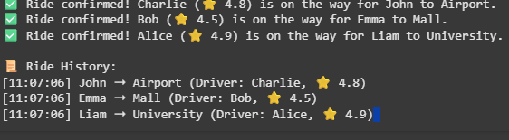

# Ride-Sharing Dispatch Simulator 🚖

<p align="center">
  
  
  
</p>

A **simulation engine** for ride-sharing services.  
Drivers are assigned to riders based on **distance** and **ratings**.

---

## ✨ Features
- Manage driver & rider queues  
- Match nearest available driver  
- Priority assignment using ratings  
- Track ride history  

---

## ⚙️ Tech
- **Language**: Python  
- **Data Structures**: Queues, Priority Queues (heapq)  
- **Concepts**: Scheduling, Distance Calculation  

---

---

## ⚡ Quick Start  

```bash
# Clone this repository
git clone https://github.com/your-username/Ride-Sharing-Dispatch.git

# Navigate to project folder
cd Ride-Sharing-Dispatch/src

# Run the program
ride_sharing.py



